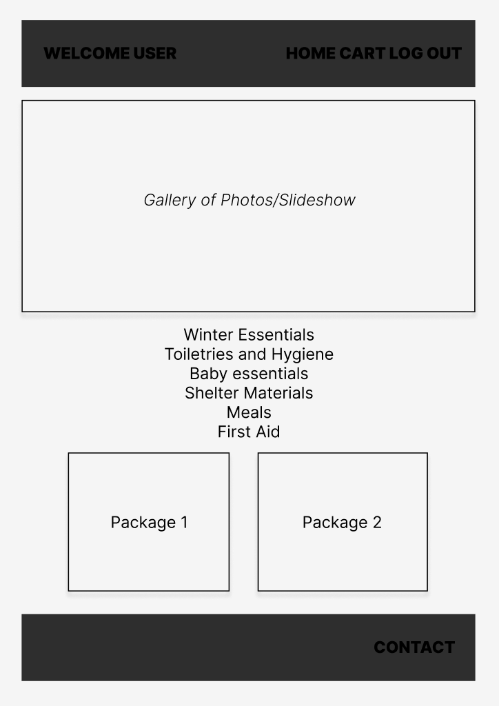

# Earthquake Emergency E-commerce
The Earthquake Emergency E-commerce app is designed to help individuals affected by the catastrophic earthquakes that occurred in Turkey and Syria on February 6th. The app allows users to purchase emergency packages for those who have been impacted by the earthquakes. By using this app, users can make a meaningful contribution to the relief efforts and support the affected communities. Everyone has the power to make a positive impact, and I hope [this app](https://earthquake-emergency.herokuapp.com/) will inspire individuals to come together and support those who need it most.

## Wireframe:

## User Stories:
- AAU, I want to be able to sign up, log in, and log out
- AAU, I want to be able to see items for sale by category
- AAU, I want to be able to add an item to my cart
- AAU, I want to be able to update my cart
- AAU, I want to be able to checkout

## Technologies Used:
- MERN-stack: (MongoDB/Mongoose, Express, React, Node)
- JavaScript
- CSS
- HTML
- Figma
- IconScout

## Next Steps:
- Revamp styling
- Improve login/sign up feature to allow users to remain on website, and click on all of the navbar links
- Add navbar hamburger feature
- Add navbar icons
- Consume data from a third-party API like Stripe
- Include media query 
